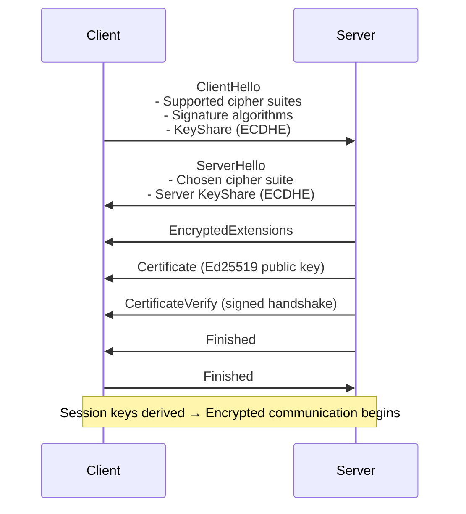
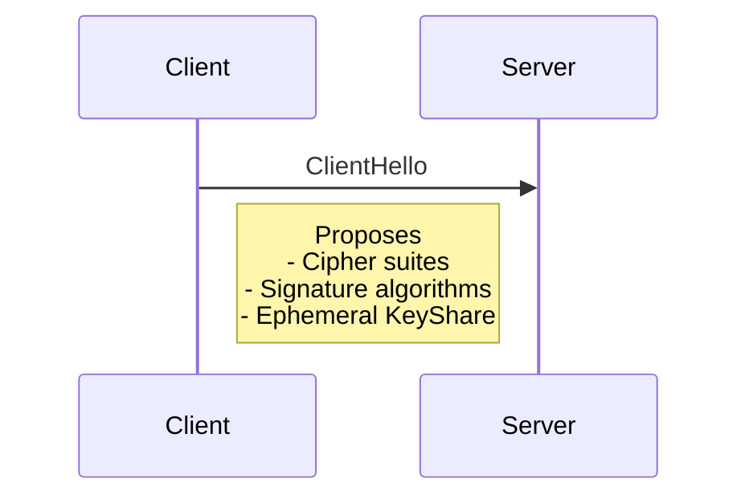
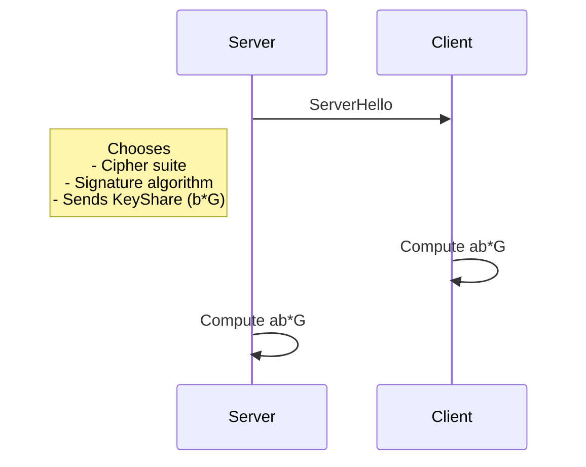
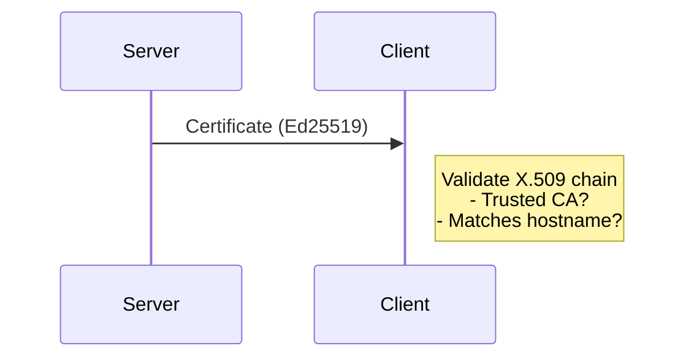
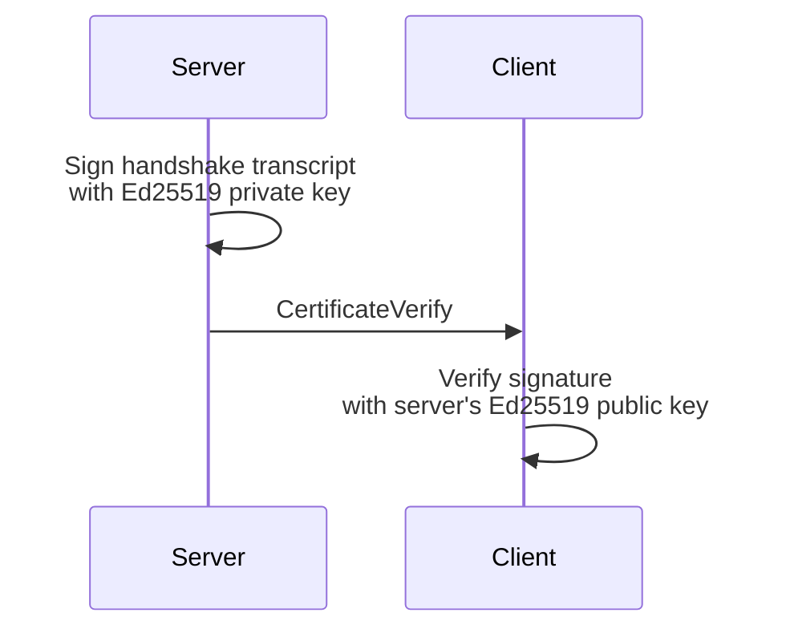

Got it ✅
Here’s a single **self-contained Markdown document** that combines everything we discussed. It includes:

* A high-level TLS 1.3 handshake sequence diagram
* Detailed per-step diagrams (Steps 1–4)
* Narratives for each step
* Comparisons of **RSA vs Elliptic Curve (Ed25519/ECDHE)** usage

---

# TLS 1.3 Handshake with Ed25519 Certificates

This document explains how a TLS 1.3 handshake works when the server presents an **Ed25519 certificate** (comparable to the SSH key format you provided, but wrapped in X.509).

We contrast **Elliptic Curve Cryptography (ECC)** with **RSA** at each stage.

---

## 🔝 High-Level Sequence Diagram

---

# 🧩 Step-by-Step Details

---

## 🔑 Step 1: ClientHello

### What Happens

* Client advertises supported **cipher suites** (AES-GCM, ChaCha20).
* Lists **signature algorithms** it accepts (`rsa_pss_rsae_sha256`, `ecdsa_secp256r1_sha256`, `ed25519`).
* Sends a **KeyShare**: an ephemeral elliptic curve point (e.g., `a*G` on `X25519`).

### RSA vs ECC

* **RSA (TLS ≤1.2)**: No KeyShare. Client would later encrypt a pre-master secret with RSA public key.
* **ECC (TLS 1.3)**: Client must send an ephemeral elliptic-curve key → forward secrecy is built-in.

---

## 🔒 Step 2: ServerHello

### What Happens

* Server chooses a cipher suite and signature algorithm.
* Sends its **KeyShare** (e.g., `b*G`).
* Both sides compute the **shared secret** = `ab*G`.

### RSA vs ECC

* **RSA**: No DH exchange; the server just provided its RSA cert. The shared secret came from the client encrypting with RSA. → No forward secrecy.
* **ECC**: Shared secret derived via elliptic curve Diffie–Hellman. → Forward secrecy by default.

---

## 📜 Step 3: Server Certificate

### What Happens

* Server sends **X.509 certificate** with its long-term public key.
* Client validates certificate: trusted CA, valid hostname, unexpired.

### RSA vs ECC

* **RSA**: Cert contains 2048–4096 bit modulus. Used for signing (TLS 1.3) or encryption (TLS ≤1.2).
* **Ed25519/ECDSA**: Cert contains curve public key (`Q = d*G`). Used only for digital signatures.
* **Efficiency**:

  * RSA 3072 ≈ Ed25519 in strength, but RSA keys and signatures are much larger and slower.
  * Ed25519 keys are just 32 bytes; signatures are 64 bytes.

---

## ✍️ Step 4: CertificateVerify

### What Happens

* Server proves it *controls the private key* corresponding to the certificate.
* It signs the running transcript of all handshake messages.
* Client verifies signature with the public key from the certificate.

### RSA vs ECC

* **RSA**: Server signs transcript using RSA-PSS. Signature size \~256–512 bytes.
* **Ed25519/ECDSA**: Server signs transcript using elliptic curve math. Signature fixed at 64 bytes, very fast.

---

## ✅ Step 5: Finished Messages

(Not requested, but for completeness.)

* Server sends `Finished` (encrypted with handshake key).
* Client verifies, then sends its own `Finished`.
* Session keys derived from DH shared secret + HKDF.

---

# ⚖️ RSA vs ECC (Ed25519/ECDHE) — At a Glance

| Step                  | RSA (legacy)                                 | ECC / Ed25519 (modern)                                   |
| --------------------- | -------------------------------------------- | -------------------------------------------------------- |
| ClientHello (Step 1)  | No key share; client prepares RSA encryption | Client sends ephemeral curve point (KeyShare)            |
| ServerHello (Step 2)  | No key share; relies on RSA                  | Server sends ephemeral KeyShare; shared secret via ECDHE |
| Certificate (Step 3)  | RSA modulus, large certs, slow signing       | Small curve keys, efficient signatures                   |
| CertificateVerify (4) | RSA-PSS signature (large, slower)            | Ed25519 signature (64 bytes, very fast)                  |
| Security              | Forward secrecy optional (TLS ≤1.2)          | Forward secrecy mandatory (TLS 1.3)                      |
| Performance           | Sign slow, verify fast                       | Both sign/verify fast, short messages                    |

---

📌 **Key Takeaway**:

* RSA was historically used for both *encryption* and *signatures*.
* In TLS 1.3, all authentication is signature-only.
* Elliptic curves (ECDHE + Ed25519) are much smaller, faster, and always provide forward secrecy.

---

Would you like me to also include a **side-by-side math breakdown** (with example equations) of **RSA CertificateVerify vs Ed25519 CertificateVerify** so you can see exactly what’s computed in Step 4?
