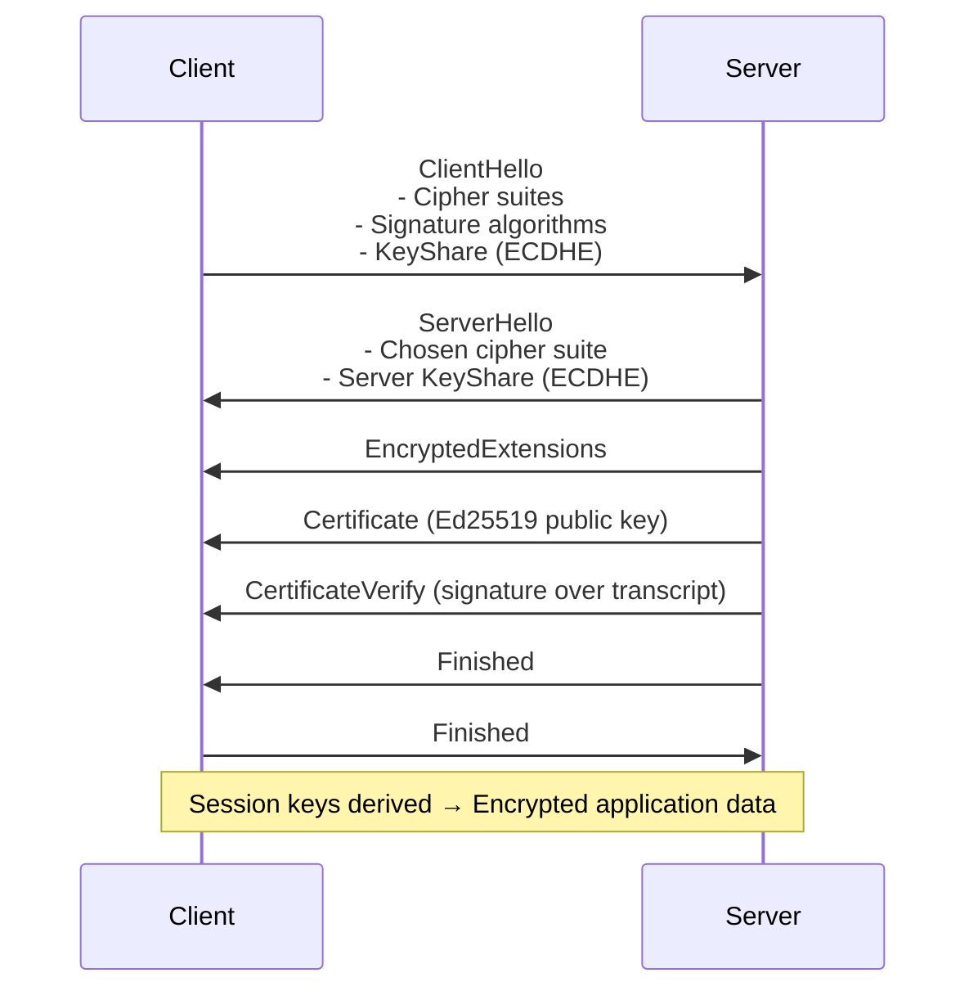
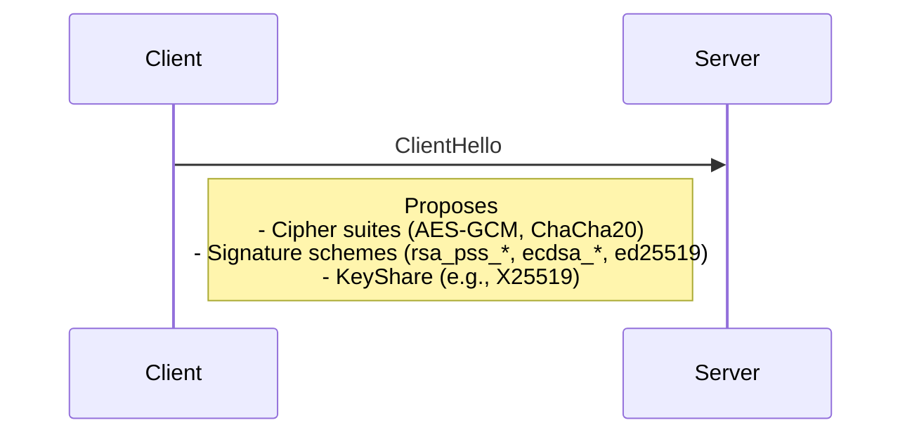
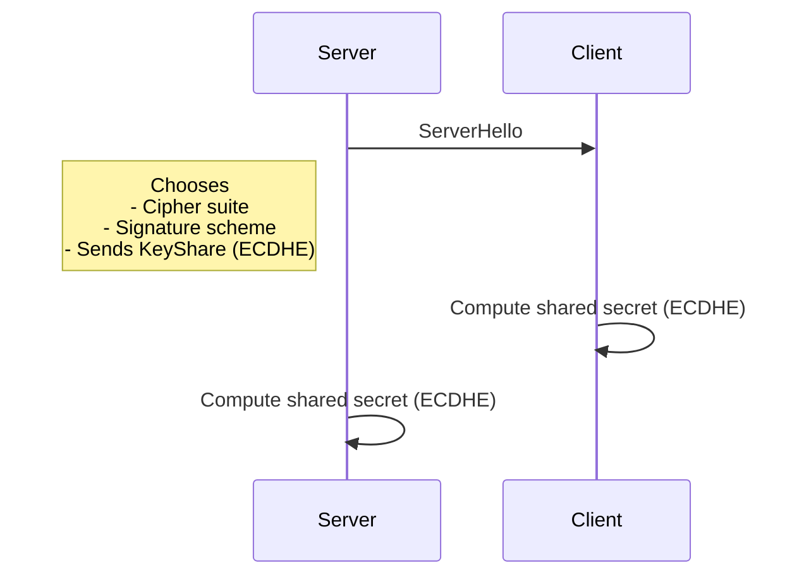
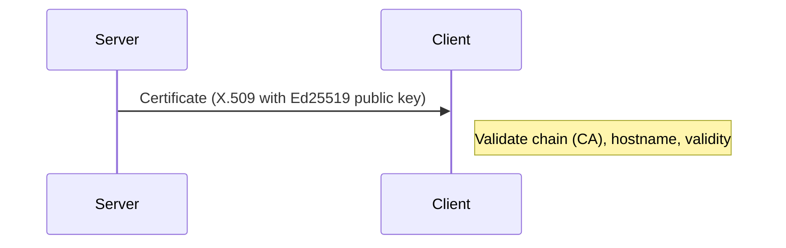
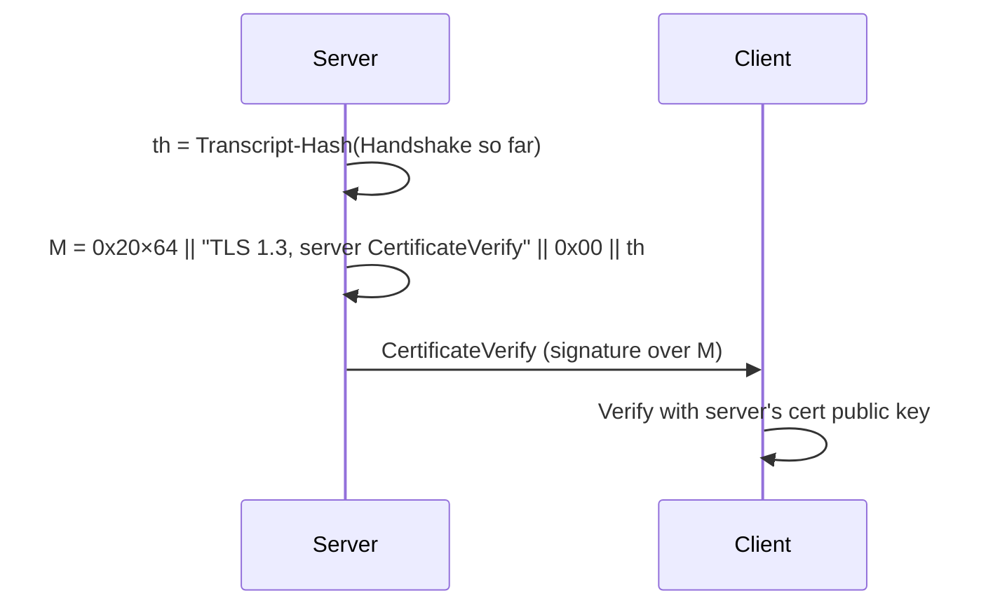

# TLS 1.3 Handshake (with Ed25519 certificate) — Full Guide

> The `ssh-ed25519` string you shared is in **OpenSSH** public key format (for SSH). TLS uses **X.509 certificates**. The **cryptography** (Ed25519) can be the same, but the **format/packaging** differs.

---

## 🔝 High-Level Sequence Diagram



---

# 🧩 Step-by-Step Details

## 🔑 Step 1 — ClientHello (granular)



**What happens**

* Client lists **cipher suites** and **signature schemes**.
* Sends **KeyShare** (ephemeral ECDH public key). For X25519, it’s a 32-byte point.

**ECC vs RSA**

* **ECC / TLS 1.3**: Client **must** send an ephemeral **KeyShare** → built-in forward secrecy.
* **RSA (pre-1.3 style)**: No ECDH share; client later encrypted a pre-master secret with RSA (no inherent forward secrecy).

---

## 🔒 Step 2 — ServerHello (granular)



**What happens**

* Server picks a cipher suite + signature scheme from the client’s list.
* Sends its **ephemeral KeyShare**.
* Both compute the **same** ECDHE secret (e.g., with X25519: scalar multiplies on Curve25519).

**ECC vs RSA**

* **ECC/ECDHE**: Shared secret via elliptic-curve Diffie–Hellman → **forward secrecy**.
* **RSA (pre-1.3 style)**: Secret = random value encrypted with RSA → **no** forward secrecy if RSA key is later compromised.

---

## 📜 Step 3 — Server Certificate (granular)



**What happens**

* Server sends **X.509 certificate chain**. Leaf cert holds the server’s **Ed25519** (or RSA) public key.
* Client validates trust chain, name, validity period, EKU, etc.

**ECC vs RSA**

* **RSA**: Large modulus (2048–4096 bits). In TLS 1.3, used **only for signatures** (RSA-PSS).
* **Ed25519/ECDSA**: Small keys (Ed25519 pubkey = 32 bytes). Used **only for signatures**.
* **Efficiency**: Ed25519 signatures are **64 bytes**, fast; RSA needs larger keys/signatures for comparable security (e.g., RSA-3072 ≈ 128-bit).

---

## ✍️ Step 4 — CertificateVerify (granular)



**TLS 1.3 input string to sign**

* Let `th = Transcript-Hash(Handshake messages so far)` using the cipher-suite’s hash (e.g., SHA-256).
* Let `ctx = "TLS 1.3, server CertificateVerify"`.
* The exact bytes signed are:

```
M = (0x20 repeated 64) || ctx || 0x00 || th
```

**Algorithm used**

* **RSA certificate** → **RSA-PSS** signature over `M` (salt len = hash len).
* **Ed25519 certificate** → **Ed25519 (EdDSA)** signature over `M` (fixed 64 bytes).

---

# ⚖️ RSA-PSS vs Ed25519 (CertificateVerify) — Side-by-Side

| Item           | RSA-PSS                                  | Ed25519 (EdDSA)                                 |   |    |
| -------------- | ---------------------------------------- | ----------------------------------------------- | - | -- |
| Key            | `(n,e)` / `d`                            | Public `A = a·B`, secret scalar `a` (from seed) |   |    |
| Hash inside    | Configured (e.g., SHA-256)               | SHA-512 internally                              |   |    |
| Randomness     | Uses random salt per signature           | Deterministic from secret prefix + message      |   |    |
| Signature size | = modulus size (e.g., 256B for RSA-2048) | 64B (R                                          |   | S) |
| Verify check   | PSS padding checks; `s^e mod n`          | Group eq: `S·B == R + k·A`                      |   |    |

---

## 🧵 How the Transcript Hash Works (TLS 1.3)

TLS 1.3 computes a running hash (`th`) over the concatenation of the **Handshake** messages (including their handshake message headers). The hash function is the cipher suite’s hash (e.g., SHA-256 for `TLS_AES_128_GCM_SHA256`).

For a typical server-authenticated handshake (no PSK, no client cert):

1. **Included before Server CertificateVerify** (thus inside `th` used for the server’s signature):

   * `ClientHello`
   * `ServerHello`
   * `EncryptedExtensions`
   * `Certificate` (server)
   * *(Note: the `CertificateVerify` itself is **not** included yet — we sign over everything **up to** it.)*

2. **Included before Server Finished** (for the Finished MAC):

   * All of the above **plus** `CertificateVerify`

3. **Included before Client Finished** (for the client’s Finished MAC):

   * All of the above **plus** `Finished` (server)
   * (If the client presents a certificate in mutual auth, then client `Certificate` and client `CertificateVerify` also contribute before client `Finished`.)

> **Important**: Key schedule secrets (early, handshake, application) are derived using HKDF with inputs including ECDHE output, PSK (if any), and **the transcript hash at specific points**. The transcript hash “binds” keys to what was actually exchanged, preventing reordering or tampering.

---

## 🧪 Toy Walk-Through: Ed25519 `CertificateVerify` by Hand (Illustrative)

> ⚠️ **This is a didactic toy** that compresses Ed25519 math to tiny numbers so you can follow the flow with pencil and paper. **Do not** use these numbers or steps for real cryptography. Real Ed25519 uses a \~252-bit prime-order group and SHA-512; here we simulate the shapes, not the real sizes.

### Toy Setup

* **Toy group order**: `L = 97` (real Ed25519 uses a \~252-bit order)

* **Base point**: `B` (we’ll represent points abstractly as multiples of `B`)

* **Toy hash**: `H(·)` maps arbitrary input to `0…96` (i.e., `H(x) = (sum of bytes(x)) mod 97`) — just to keep math visible

* **Server secret seed**: `sk = [0x53, 0x65, 0x72, 0x76]` (“Serv”)

  * In real Ed25519, we compute `h = SHA-512(sk)`, then:

    * `a = clamp(h[0..31])` → secret scalar
    * `prefix = h[32..63]` → secret 32-byte prefix
  * **Toy simplification**: we’ll pick:

    * `a = 29` (secret scalar)
    * `prefix = [0x0A, 0x0B]`

* **Public key**: `A = a·B = 29·B`

### Build the message `M` to sign (TLS 1.3)

* Let the cipher suite hash be “SHA-256” in the real world; we’ll use **toy `H`**.

* Suppose the **Handshake transcript** so far (ClientHello, ServerHello, EncryptedExtensions, Certificate) serializes to bytes whose toy hash is:

  * `th = H(transcript) = 41`  (toy value)

* Context string for server:

  * `ctx = "TLS 1.3, server CertificateVerify"` (bytes)

* Form `M = 0x20×64 || ctx || 0x00 || th`

  * We don’t need to list all bytes; our toy hash will consume it.

### Ed25519-style signing (toy)

**Step 1 — Nonce derivation**

* Real Ed25519: `r = SHA-512(prefix || M) mod L` (deterministic)
* Toy: `r = H(prefix || M) = 58` (toy value after hashing)
* Compute point: `R = r·B = 58·B`

**Step 2 — Challenge scalar**

* Real Ed25519: `k = SHA-512( enc(R) || enc(A) || M ) mod L`
* Toy: `k = H(R || A || M) = 23`  (toy value)

**Step 3 — Response scalar**

* `S = (r + k·a) mod L`
* Compute: `k·a = 23·29 = 667`
* `667 mod 97` →

  * 97×6 = 582; 667−582 = 85
* So `k·a mod 97 = 85`
* Add `r`: `S = (58 + 85) mod 97 = 143 mod 97 = 46`

**Signature**

* `(R, S) = (58·B, 46)`

So the server sends `CertificateVerify` carrying `(R=58·B, S=46)` (toy encodings).

### Client Verification (toy)

* Recompute `k = H(R || A || M) = 23` (same as signer, because deterministic)

* Check the **group equation**:

  ```
  S·B  ==  R + k·A
  ```

  Left side:

  * `S·B = 46·B`

  Right side:

  * `k·A = 23·(29·B) = (23·29)·B = 667·B`
  * `667 mod 97 = 85`, so `k·A = 85·B`
  * `R + k·A = 58·B + 85·B = (58+85)·B = 143·B`
  * `143 mod 97 = 46`, so RHS = `46·B`

* Since `46·B == 46·B`, the signature **verifies** ✅

> That arithmetic mirrors real Ed25519 logic, just with toy-sized numbers and a toy hash. In reality, all operations are over the Edwards25519 group with \~128-bit security, using SHA-512 and precise encodings.

---

## 🧾 Which Handshake Messages Feed Which Hash (and When)?

Here’s a concise map for the **server-authenticated** (no PSK, no client cert) path:

| Stage                                | Transcript contents used                                                                                   |   |                     |   |                     |   |                |
| ------------------------------------ | ---------------------------------------------------------------------------------------------------------- | - | ------------------- | - | ------------------- | - | -------------- |
| **Server `CertificateVerify`** signs | \`th = Hash(ClientHello                                                                                    |   | ServerHello         |   | EncryptedExtensions |   | Certificate)\` |
| **Server `Finished`** MACs           | Hash over: *(the above)* \`                                                                                |   | CertificateVerify\` |   |                     |   |                |
| **Client `Finished`** MACs           | Hash over: *(the above)* \`                                                                                |   | Finished(server)\`  |   |                     |   |                |
| **Key schedule taps**                | Early/Handshake/Application secrets drawn via HKDF using ECDHE result + **intermediate transcript hashes** |   |                     |   |                     |   |                |

(If the client authenticates with a certificate, then client `Certificate` and `CertificateVerify` are added to the transcript before the client’s `Finished`.)

---

## 🧠 Practical Takeaways

* TLS 1.3 **always** uses (EC)DHE for key exchange → **forward secrecy** by default.
* Authentication is by **signature only** in 1.3:

  * **RSA certificates** → **RSA-PSS** over the standardized `M`.
  * **Ed25519/ECDSA certificates** → curve signature over the same `M`.
* **Ed25519** offers **short, fast** signatures (64B) and compact keys, with security comparable to much larger RSA keys.

---

Perfect request ✅ — here’s a **Glossary of acronyms and terms** used in the TLS 1.3 + Ed25519 handshake explanation. Each entry has a short definition and a reputable **external link** (Wikipedia, OpenSSL docs, or Linux vendor documentation).

---

# 📖 TLS 1.3 + Ed25519 Glossary

---

### **TLS (Transport Layer Security)**

A cryptographic protocol for secure communication on the Internet, used in HTTPS, SMTP, IMAP, etc.
🔗 [Wikipedia: TLS](https://en.wikipedia.org/wiki/Transport_Layer_Security)

---

### **X.509 Certificate**

Standard format for public key certificates used in TLS, containing a public key and identity information.
🔗 [Wikipedia: X.509](https://en.wikipedia.org/wiki/X.509)

---

### **RSA (Rivest–Shamir–Adleman)**

A widely used public-key cryptosystem based on the hardness of factoring large integers. Used for digital signatures and (historically) encryption in TLS.
🔗 [Wikipedia: RSA (cryptosystem)](https://en.wikipedia.org/wiki/RSA_%28cryptosystem%29)

---

### **RSA-PSS (Probabilistic Signature Scheme)**

A modern padding scheme for RSA digital signatures, required in TLS 1.3. Provides provable security against chosen-message attacks.
🔗 [Wikipedia: RSA-PSS](https://en.wikipedia.org/wiki/Probabilistic_signature_scheme)

---

### **Ed25519 (Edwards-curve Digital Signature Algorithm over Curve25519)**

A modern elliptic-curve signature system with small, fast, and secure signatures (64 bytes). Used in TLS and SSH.
🔗 [Wikipedia: EdDSA](https://en.wikipedia.org/wiki/EdDSA)

---

### **ECDHE (Elliptic Curve Diffie–Hellman Ephemeral)**

A key exchange method using elliptic curves. “Ephemeral” keys are generated fresh for each session, enabling **forward secrecy**.
🔗 [Wikipedia: ECDHE](https://en.wikipedia.org/wiki/Diffie%E2%80%93Hellman_key_exchange#Elliptic_curve_Diffie%E2%80%93Hellman)

---

### **Diffie–Hellman (DH) Key Exchange**

A protocol that allows two parties to derive a shared secret over an insecure channel. ECDHE is an elliptic-curve version.
🔗 [Wikipedia: Diffie–Hellman key exchange](https://en.wikipedia.org/wiki/Diffie%E2%80%93Hellman_key_exchange)

---

### **Forward Secrecy (Perfect Forward Secrecy, PFS)**

A property ensuring that past session keys cannot be decrypted even if long-term keys are later compromised. Achieved in TLS 1.3 by using ephemeral ECDHE.
🔗 [Wikipedia: Forward secrecy](https://en.wikipedia.org/wiki/Forward_secrecy)

---

### **Handshake Transcript Hash**

A running hash of all handshake messages exchanged so far in TLS 1.3. Used in key derivation and CertificateVerify to bind signatures to the exact transcript.
🔗 [RFC 8446 — TLS 1.3 Specification (Section 4.4.1)](https://datatracker.ietf.org/doc/html/rfc8446#section-4.4.1)

---

### **CertificateVerify**

A TLS 1.3 handshake message where the server (or client, in mutual TLS) proves possession of the private key by signing the transcript hash.
🔗 [RFC 8446 — TLS 1.3 CertificateVerify](https://datatracker.ietf.org/doc/html/rfc8446#section-4.4.3)

---

### **HKDF (HMAC-based Key Derivation Function)**

A key derivation function used in TLS 1.3 to derive session keys from shared secrets and transcript hashes.
🔗 [Wikipedia: HKDF](https://en.wikipedia.org/wiki/HKDF)

---

### **ChaCha20-Poly1305**

A cipher suite combining the ChaCha20 stream cipher with the Poly1305 message authentication code. Common in TLS for mobile/low-power devices.
🔗 [Wikipedia: ChaCha20-Poly1305](https://en.wikipedia.org/wiki/ChaCha20-Poly1305)

---

### **AES-GCM (Advanced Encryption Standard – Galois/Counter Mode)**

An authenticated encryption mode for AES, widely used in TLS cipher suites. Provides confidentiality and integrity.
🔗 [Wikipedia: Galois/Counter Mode](https://en.wikipedia.org/wiki/Galois/Counter_Mode)

---

### **SHA-256 / SHA-512 (Secure Hash Algorithm family)**

Cryptographic hash functions used in TLS for transcript hashes and digital signatures.
🔗 [Wikipedia: SHA-2](https://en.wikipedia.org/wiki/SHA-2)

---

### **MGF1 (Mask Generation Function 1)**

A deterministic padding function used in RSA-PSS to expand hashes to desired lengths.
🔗 [Wikipedia: Mask generation function](https://en.wikipedia.org/wiki/Mask_generation_function)

---

### **OpenSSL**

A widely used open-source library implementing TLS/SSL protocols, including support for RSA, ECDSA, Ed25519, and more.
🔗 [OpenSSL Official Documentation](https://www.openssl.org/docs/)

---

### **Mutual TLS (mTLS)**

A variant of TLS where both client and server present certificates to authenticate each other.
🔗 [Wikipedia: Mutual authentication](https://en.wikipedia.org/wiki/Mutual_authentication)

---

### **SSH (Secure Shell)**

A protocol for secure remote login and tunneling. Often uses `ssh-ed25519` keys (same algorithm as TLS Ed25519, but in a different format).
🔗 [Wikipedia: SSH](https://en.wikipedia.org/wiki/Secure_Shell)

---

Would you like me to **append this glossary to the end of the existing Markdown handshake doc** so you have a single, unified reference file — or keep it as a **separate glossary section**?
